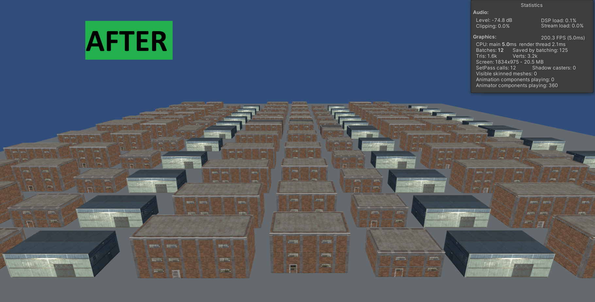

# Cube Impostor Generator for Unity

## Overview

The Cube Impostor Generator is a simple yet useful Unity Editor tool designed to create cube-shaped impostors for 3D objects. It's particularly useful for optimizing Unity scenes with many cube-like structures such as buildings, especially for highest LOD levels or distant objects.

## Features

- Generates cube-shaped impostors from complex and multi-material 3D models in Unity
- Creates 1 atlas texture for all six faces of the cube
- Supports LOD (Level of Detail) integration
- Customizable texture size and trimming options
- Applies to prefabs for easy integration into existing Unity projects

## Advantages of Cube Impostors

- Can be static batched for improved performance
- Allows for further combination and atlasing
- Represents real geometry, avoiding angle-switching artifacts of shader-based impostors
- Can be lightmapped for better visual integration

## Disadvantages

- Limited to cube-shaped objects only (e.g., buildings, boxes)

## How It Works

1. The tool captures six orthographic views of the source object (front, back, left, right, top, bottom).
2. It generates an atlas texture containing all six views.
3. A custom cube mesh is created with UVs mapped to the atlas.
4. The resulting impostor can be integrated into the scene's LOD system.

## Usage

1. Open the Cube Impostor Generator window from `Tools > Roundy > Cube Impostor Generator` in Unity.
2. Assign the source object you want to create an impostor for.
3. Adjust settings like texture size, trim amount, and shader.
4. Click "Generate Impostor" to create the impostor.
5. Optionally, apply changes to prefabs and adjust LOD settings.

## Settings

- **Source Object**: The GameObject to create an impostor for.
- **Atlas Texture Size**: Size of the final atlas texture (higher values for better quality, larger file size).
- **Trim Amount**: Adjusts trimming of empty space around the impostor.
- **Shader**: Select the shader for the impostor material.
- **Create LOD**: Automatically sets up LOD with the original object and impostor.
- **Apply to Prefab**: Applies changes to the prefab if the source is a prefab instance.
- **Mark as Static**: Marks the impostor GameObject as static for batching.

## Tips

- Best suited for cube-like objects such as buildings or containers in Unity scenes.
- Ideal for highest LOD levels or distant objects in your Unity project.
- Experiment with different texture sizes and trim amounts for optimal results.
- Use in combination with other Unity optimization techniques for best performance.

## Installation

1. Copy the `CubeImpostorGenerator.cs` script into your Unity project's `Editor` folder.
2. The tool will appear under `Tools > Roundy > Cube Impostor Generator` in the Unity menu.

## Contributing

Contributions are welcome! Please feel free to submit a Pull Request.

